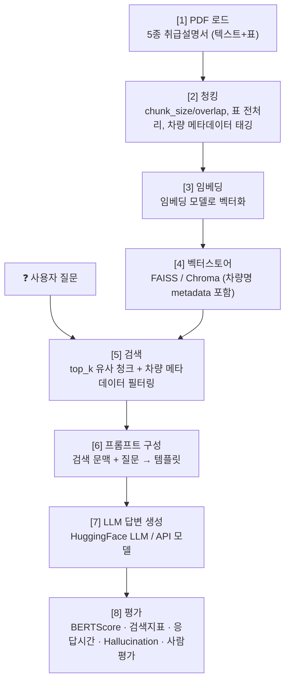

# 🚗 자동차 취급설명서 기반 RAG 질의응답 시스템

> **파워트레인·차종별 비교 서비스**
> 현대·기아 차량 5종의 취급설명서 PDF를 기반으로, 사용자의 자연어 질문에 **근거 문장과 함께** 답하는 검색증강생성(RAG) 질의응답 시스템

  
  
  
  

---

## 📌 프로젝트 개요

일반 LLM은 **특정 차종 취급설명서의 정확한 수치·정비 주기·경고등 정보를 알지 못하며**, 물어보면 그럴듯하게 지어냅니다(Hallucination).
본 프로젝트는 제조사가 무료 배포하는 취급설명서 PDF를 RAG로 연결하여, 실제 운전자의 질문에 정확히 답하는 시스템을 구현하고 **어떤 설정 조합이 가장 좋은 답을 내는지 실험적으로 비교**합니다.

### 이런 질문에 답합니다
- 💬 "계기판에 이 경고등 떴는데 뭐예요?"
- 💬 "엔진오일 교환주기는 몇 km예요?"
- 💬 "급속충전 시간은 얼마나 걸려요?"
- 💬 "수소 충전은 어떻게 하나요?"

---

## 📚 대상 문서 (5권)

| 차량 | 파워트레인 | 차체 | 페이지 | 파일 |
|---|---|---|---:|---|
| **아반떼** | 가솔린 | 세단 | 443p | `CN7_2026_ko_KR.pdf` |
| **아반떼 하이브리드** | 하이브리드(HEV) | 세단 | 446p | `CN7HEV_2026_ko_KR.pdf` |
| **아이오닉6** | 전기차(EV) | 세단 | 573p | `CE1_2025_ko_KR.pdf` |
| **투싼** | 디젤 | SUV | 544p | `NX4_2025_ko_KR.pdf` |
| **넥쏘** | 수소차(FCEV) | SUV | 578p | `NH2_2026_ko_KR.pdf` |

**총 2,584 페이지** · 현대자동차 공식 다운로드 센터 배포본

> 📢 **5권으로 5대 파워트레인(가솔린·디젤·하이브리드·전기·수소)을 전부 커버**하는 것이 본 주제의 최대 강점입니다.

---

## 💡 주제 선정 이유

1. **데이터 확보 용이** — 현대 공식 다운로드 센터에서 취급설명서 PDF를 무료 배포
2. **정답이 명확** — 수치·주기·절차 위주라 근거 문장 추출이 쉽고 BERTScore가 제대로 작동
3. **표가 많아 청킹 실험이 살아남** — 정비 주기표·규격표·경고등 목록. 표가 청크에서 잘리면 답이 무너지므로 **성능 차이가 눈에 보임**
4. **5대 파워트레인 전부 커버** — 문서 간 내용 차이가 커서 비교·할루시네이션 실험이 자연스럽게 도출
   - 예: EV에 *"엔진오일 교환주기?"* → **"해당 없음"** 이 나와야 정상
5. **유니크 + 실용** — 흔하지 않은 주제이면서 실제 운전자에게 바로 쓸모 있음

---

## 🔍 사전 검증 결과 (PDF 진단)

프로젝트 착수 전 [`src/check_pdf.py`](src/check_pdf.py)로 5권 전체의 추출 가능성을 검증했습니다.

### 판정: ✅ **5권 전부 통과 — RAG 투입 가능**

| 차량 | 한글 추출량 | 판정 |
|---|---:|:---:|
| 아반떼 | 582자/페이지 | ✅ |
| 아반떼 HEV | 635자/페이지 | ✅ |
| 아이오닉6 | 447자/페이지 | ✅ |
| 투싼 | 567자/페이지 | ✅ |
| 넥쏘 | 374자/페이지 | ✅ |

> 📌 **결론: 베이스라인 로더는 PyMuPDF를 사용합니다.**
> 이 발견은 실험 ②(Document Retrieval)의 핵심 소재이자, 본 프로젝트의 기술적 난제 해결 사례입니다.

### 📍 정비 주기표 위치 (평가셋 작성 시 참고)
표는 문서 **끝 정비 챕터에 집중**되어 있습니다.
`아반떼 p.386~395` · `아이오닉6 p.530~531` · `넥쏘 p.534~536`

---

## 🎯 목표

### 최종 목표
5종 취급설명서 기반 RAG 질의응답 시스템을 **LangChain으로 구현**하고, LLM·프롬프트·벡터스토어·청킹 설정을 바꿔가며 **어떤 조합이 가장 정확한 답을 내는지 비교 평가**한다.

### 세부 목표
1. 파워트레인이 다른 차량 간 질문에서 **문서 구분 검색이 정확한가**
2. **표에 담긴 정보**(정비 주기 등)를 잘 검색·답변하는가
3. **할루시네이션**(엉뚱한 차량 정보 혼입)을 얼마나 억제하는가

---

## 🏗️ 시스템 파이프라인

| 단계 | 내용 |
|:---:|---|
| **[1] PDF 로드** | 5종 취급설명서 로드 (텍스트 + 표 추출) |
| **[2] 청킹** | chunk_size / overlap 설정, 표 전처리, 차량 메타데이터 태깅 |
| **[3] 임베딩** | 임베딩 모델로 벡터화 |
| **[4] 벡터스토어** | FAISS / Chroma 저장 (차량명 metadata 포함) |
| **[5] 검색** | 질문 임베딩 → top_k 유사 청크 검색 (유사도 알고리즘 + 메타데이터 필터) |
| **[6] 프롬프트 구성** | 검색 문맥 + 질문 → 프롬프트 템플릿 |
| **[7] LLM 답변** | HuggingFace LLM / API 모델로 생성 |
| **[8] 평가** | BERTScore, 검색 지표, 응답시간, Hallucination, 사람 평가 |

---

## 👥 팀 구성 & 역할 분담 (4인 1팀)

| 담당 | 역할 | 파이프라인 구간 |
|:---:|---|:---:|
| **오현택 (팀장)** | 프로젝트 총괄 + 평가체계 구축 + LLM 모델 비교 | `[7]` `[8]` |
| **이한이** | 문서 로드 · 청킹 · 표 전처리 | `[1]` `[2]` |
| **김용주** | 임베딩 · 벡터스토어 · 검색 · **차량 메타데이터 필터링** | `[3]` `[4]` `[5]` |
| **박준혁** | 프롬프트 엔지니어링 | `[6]` |

> 발표는 4명이 각자 자기 실험을 **5분씩(총 20분)** 담당합니다.

---

## 🧪 실험 항목 (4개 — 평가표 4축 매칭)

### ① RAG / Evaluation — 담당 **A**
- **내용**: HuggingFace LLM 여러 개(Qwen2.5, SOLAR, EEVE 등) + API 모델(ChatGPT / Claude / Upstage)을 같은 조건에서 비교. 평가 데이터셋·BERTScore 자동화 구축
- **변수**: `LLM 모델`
- **답할 질문**: *"어떤 LLM이 가장 좋은 답변을 내는가?"*

### ② Document Retrieval — 담당 **B**
- **내용**: PDF 로더 비교(**PyMuPDF** vs pypdf vs pdfplumber), `chunk_size` · `overlap` · `top_k` 그리드 실험, **표를 마크다운으로 변환**했을 때의 효과
- **변수**: `로더` / `chunk_size` / `overlap_size` / `top_k` / `표 전처리 방식`
- **답할 질문**: *"chunk_size·overlap·top_k가 답변 품질에 어떤 영향을 주는가?"*
- ⭐ **승부처**: **회전된 정비 주기표**를 로더별로 얼마나 정확히 복원하는가 (사전 검증에서 로더 간 결정적 차이 확인됨)
- ⭐ 표 참조 질문에서 표 전처리 유무에 따른 정확도 차이를 별도로 측정

### ③ Semantic Search — 담당 **C**
- **내용**: 임베딩 모델 비교(ko-sbert vs bge-m3 vs multilingual-e5), 벡터스토어 비교(FAISS vs Chroma), 검색 방식 비교(cosine similarity vs MMR), **질문에서 차량명 추출 → 메타데이터 필터링**
- **변수**: `임베딩 모델` / `벡터스토어` / `유사도 알고리즘` / `메타데이터 필터 유무`
- **답할 질문**: *"어떤 벡터스토어·검색 방법이 더 좋은 답변을 얻는가?"*
- ⭐ **차별화**: 메타데이터 필터링으로 **차량 간 정보 혼입(cross-contamination)** 을 얼마나 막는가 → 세부 목표 ①③ 직결

### ④ 프롬프트 엔지니어링 — 담당 **D**
- **내용**: 같은 모델에 프롬프트 3종 비교
  - **(기본)** 단순 문맥 + 질문
  - **(역할 부여형)** "너는 자동차 정비 전문가다"
  - **(제약형)** "문맥에 없으면 '해당 정보 없음'이라고 답해라"
- **변수**: `프롬프트 템플릿`
- **답할 질문**: *"같은 모델에 프롬프트를 다르게 주면 성능이 어떻게 달라지는가?"*
- ⭐ **측정 포인트**: 제약형 프롬프트의 **할루시네이션 억제 효과** (평가셋의 '답 없음' 유형으로 직접 측정)

---
